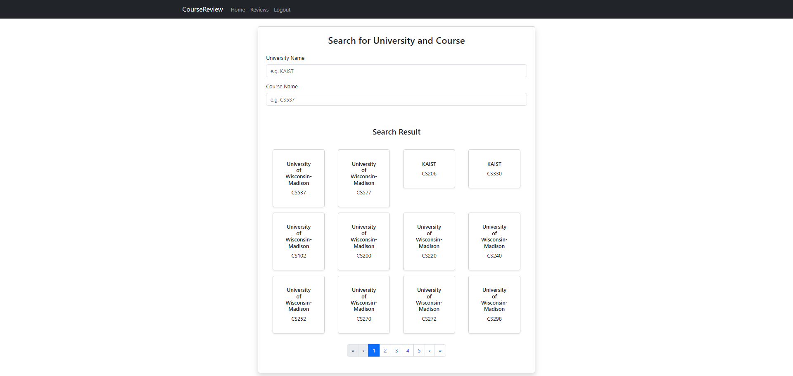
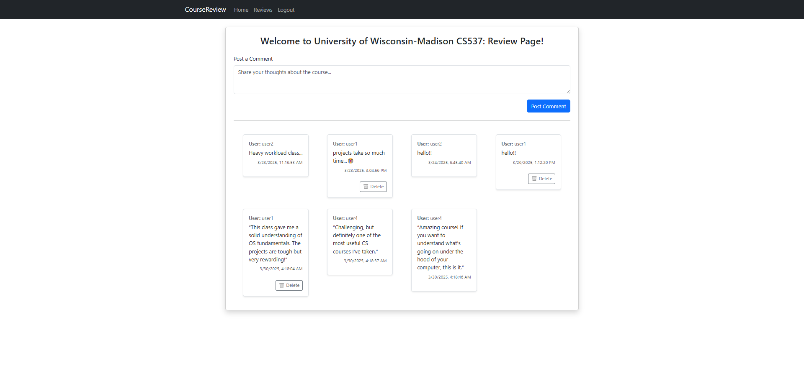

# 🎓 CourseReview – For College Students: Course Review/Feedback Platform

A full-stack web application where students can browse and post reviews about courses from colleges across the U.S. Users can register, leave feedback on courses they've taken, and view insights shared by others.

🌐 Live Demo: [https://pern-webdev.onrender.com](https://pern-webdev.onrender.com)

---

## 📚 Table of Contents

- [Overview](#overview)
- [Main Features](#main-features)
- [Planned Features](#planned-features)
- [Screenshots](#screenshots)
- [Tech Stack](#tech-stack)
- [Setup](#setup)

---

## 🔍 Overview

This project aims to create a space for students to share honest feedback about courses they've taken, helping future students make better-informed decisions. The platform supports user authentication, personalized profiles, and organized course data by university.

---

## 🧩 Main Features

- **🏠 Home Page**
  - Brief intro and navigation to all key pages

- **📝 Register / 🔐 Login / 🚪 Logout**
  - Secure user account system

- **📋 Main Page**
  - Add and delete your own comments
  - Select a specific college and browse courses within it
  - View comments from other users on each course

---

## 🧪 Planned Features

- Course creation and management UI
- Admin/moderator role to manage duplicate or invalid courses
- Profile Page
  - Displays user info: age, attended/attending college
  - Adds a "Verified" badge for users who attended the reviewed college

---

## 🖼️ Screenshots

<div style="display: flex; gap: 10px; flex-wrap: wrap;">
  
  
  
  
  
  
  
</div>

---

## ⚙️ Tech Stack

**Frontend:**
- React + TypeScript
- React-Bootstrap for styling
- React Router DOM for routing

**Backend:**
- Express.js
- Node.js
- PostgreSQL for comments/users data

**Other:**
- Cookie-based session authentication (JWT)
- Bcrypt for securely hashing and storing user passwords
- Deployed on [Render](https://pern-webdev.onrender.com)

---

## 🧑‍💻 Setup

### 🔧 Prerequisites

- [Node.js](https://nodejs.org/) installed
- [PostgreSQL](https://www.postgresql.org/) installed and running locally
- A `.env` file set up for backend

Create a .env file inside the /server directory and add the following:
```
# Server settings
PORT=port_number

# PostgreSQL database configuration
DB_HOST=localhost
DB_USER=your_db_username
DB_PASSWORD=your_db_password
DB_NAME=your_db_name
DB_PORT=5432

# JWT secret for authentication
JWT_SECRET=your_jwt_secret_key
```
📝 Replace the placeholder values with your actual PostgreSQL setup.
✅ Make sure the database is created before running the server.

---

### 📦 Clone & Install

> ⚠️ This project uses `main` as the deployment branch.  
> To get the latest development version, please clone the `dev` branch:

```bash
git clone -b dev https://github.com/dbalstjr16/PERN_webdev.git
cd my-fullstack-app

# Install root dependencies (e.g., concurrently)
npm install

# Install frontend dependencies (react-boostrap, boostrap, react-router-dom)
cd client
npm install

# Install backend dependencies (bcrypt, cookie-parser, cors, dotenv, express, jsonwebtoken, pg)
cd ../server
npm install